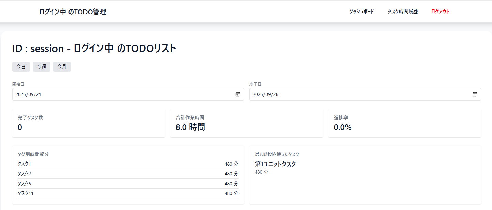
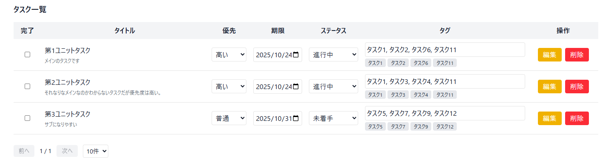
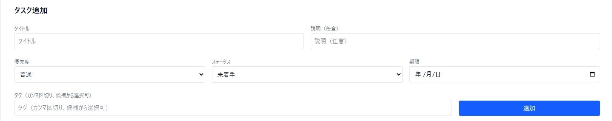
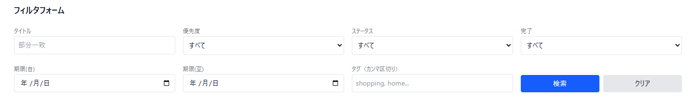
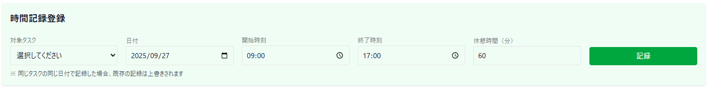
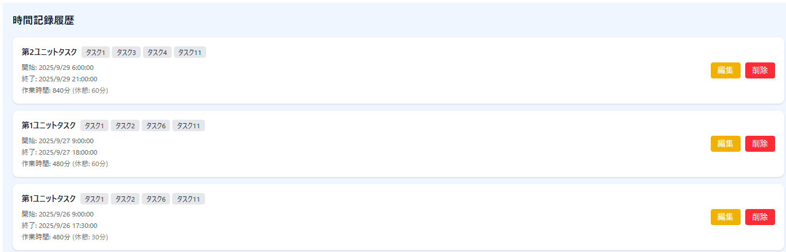
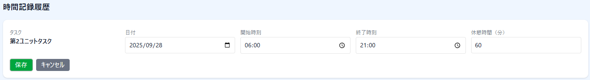

# React会員システム

## 1.会員システムプロジェクト概要
### プロジェクトの目的
- React会員システムでTODOリストを作成する
- 個別のTODOで時間管理表を作成する
### プロジェクト行程
- 2025/08/20：開始
- 2025/08/22：登録・ログイン着手
- 2025/08/27：TODOリスト着手
- 2025/09/04：Tailwindの導入
- 2025/09/12：ダッシュボードなど拡張
- 2025/09/25：Redisに換装

## 2.主要技術
| 言語・フレームワーク | バージョン |
| -------------------- | ---------: |
| Node.js | 22.18.0 |
| Next.js | 15.5.0 |
| Prisma | 6.16.0 |
| PostgreSQL | 10.9.3 |
| tailwind | 10.9.3 |
| Docker | 28.3.2 |

## 3.ダッシュボードの見方
### 3-1.開始日 / 終了日

開始日から終了日までの範囲を指定するとこの期間のタスクと合計時間を見ることが出来ます。

### 3-2.タスク

## 4.使用方法
### 4-1.タスクの追加

| 項目 | 内容 |
|---|---|
| タイトル | タスクのタイトルを入力します。 |
| 説明 | タスクの説明を入力します。任意での入力です。 |
| 優先度 | タスクの優先度、高い、普通、低いの3段階で設定できます。 |
| ステータス | 追加時のタスクの状況を設定できます。未着手、進行中、完了の3段階で設定できます。 |
| 期限 | タスクの締め切りを日付形式で設定できます。 |
| タグ | タグを設定します。カンマ「,」で区切ることが出来ます。 |

### 4-2.フィルタフォーム

| 検索項目 | 内容 |
|---|---|
| タイトル | 入力された内容が部分一致で検索します |
| 優先度 | 指定された優先度を検索します |
| ステータス | 指定されたステータスを検索します |
| 完了 | 完了か未完了かを検索します |
| 期限(自) | 期限までの日付を検索します |
| 期限(至) | 期限が過ぎた日付を検索します |
| タグ | タグを検索します。カンマ「,」で区切ることが出来ます。|

## 5.時間記録

### 5-1.時間記録登録

| 項目 | 内容 |
|---|---|
| 対象のタスク | タスクを選択します |
| 日付 | 日付を指定します |
| 開始時刻 | タスクの開始時刻を指定します |
| 終了時刻 | タスクの終了時刻を指定します |
| 休憩時間 | 開始時刻と終了時刻から差し引いた時間を指定します。分単位に入力。 |

### 5-2.時間記録履歴

| 項目 | 内容 |
|---|---|
| 日付 | 日付を指定し、編集します |
| 開始時刻 | タスクの開始時刻を編集します |
| 終了時刻 | タスクの終了時刻を編集します |
| 休憩時間 | 開始時刻と終了時刻から差し引いた時間を編集します。分単位に入力。 |
| 保存 | 変更された内容を保存します。 |
| キャンセル | 変更された内容を変更せず終了します。 |
